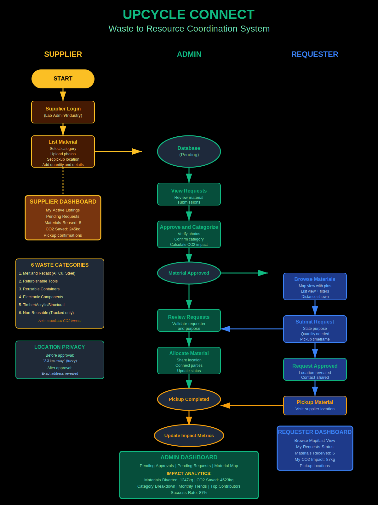

# ♻️ UpCycle Connect  
### Original Solution (Planned Full Web Application)

UpCycle Connect is a **hyper-local digital marketplace** designed to enable the reuse of **industrial and laboratory surplus materials**, connecting suppliers with students, innovators, and recycling startups to promote sustainability and circular economy practices.

> ⚠️ **Important Note**  
> This repository represents the **original and complete solution vision** for UpCycle Connect.  
> While the current implementation covers core backend functionality, **not all planned features are fully implemented yet**.  
> This README documents the **intended full-scale web application** as designed for the hackathon.

---

## 🎥 Demo Video

**Demo Link:**  
https://drive.google.com/file/d/1mD7OcFXznwgcqhHbgleags09Acj5H7CC/view?usp=drivesdk

---
## 📌 Problem Statement

Every year, **industrial units and academic laboratories discard large volumes of reusable materials**, such as:

- Metal scraps  
- Electronic components  
- Containers and lab equipment  
- Timber and fabrication offcuts  

Most of this waste ends up in landfills **not because it lacks value**, but because there is **no simple, trusted, and local system** to redistribute it.

### Key Challenges
- Environmental pollution due to unnecessary disposal  
- Wastage of reusable materials  
- High cost and limited access to resources for students and innovators  
- Lack of structured, transparent redistribution platforms  

---

## 💡 Our Original Solution Vision

**UpCycle Connect** is envisioned as a **hyper-local surplus material exchange platform** that connects:

- **Industries & academic laboratories** generating surplus materials  
- **Students, innovators, and recycling startups** who can reuse them  

The platform focuses on **local discovery, structured listings, and direct requests**, ensuring materials are reused **safely, efficiently, and responsibly**.

This approach supports sustainability while encouraging innovation and responsible resource utilization.

---

## 🧭 Platform Overview (Planned)

The system is designed around **two primary user roles**:

### 🔹 Suppliers (Sellers)
- Industrial units  
- Academic laboratories  

### 🔹 Requesters (Buyers)
- Students  
- Innovators  
- Recycling & sustainability startups  

The platform emphasizes **transparency, traceability, and locality**, rather than global resale.

---

## ✨ Core Features (Planned Full Scope)

### 🧑‍🏭 Supplier (Seller) Features
- Add surplus materials via **Add New Surplus Material**
- Provide structured material details:
  - Material category
  - Quantity
  - Condition
  - Availability type (Sell / Rent / Exchange)
- Upload images for better material visibility
- Edit, update, or remove listed materials
- Manage and track surplus inventory

---

### 🧑‍🎓 Requester (Buyer) Features
- Browse surplus materials available nearby
- Filter materials based on:
  - Category
  - Availability type
  - Location
- View detailed listings with condition and quantity
- Request materials directly from suppliers
- Reuse materials for:
  - Academic projects
  - Prototyping and innovation
  - Recycling initiatives

---

## 🧩 User Flow (Planned)

> 

## 🛠️ Tech Stack

### Backend
- Python  
- FastAPI – RESTful API framework  
- SQLite – Lightweight database (`arcane.db`)  
- SQLAlchemy (ORM)  
- Pydantic – Data validation  

### Architecture
- `models/` – Database models  
- `routes/` – API endpoints  
- `core/` – Configuration & utilities  
- `db/` – Database initialization and logic  

---

## 🌱 Sustainability Impact
- Reduces landfill waste  
- Encourages reuse of industrial and lab materials  
- Enables affordable access to resources for students and innovators  
- Promotes circular economy principles  
- Supports local sustainability initiatives  

---

## 👥 Team Members
- Shruti Awasthi  : https://github.com/being4440
- Anish Deodhar  : https://github.com/Anish-505
- Japleen Kaur Arora  : https://github.com/2024japleenarora
- Vamika Kaushik  : https://github.com/Vamikakaushik

---

## 🏁 Hackathon Note

UpCycle Connect was developed as part of a hackathon focused on addressing real-world sustainability challenges through a **practical, scalable, and impact-driven solution**.

---

## 🚀 Future Enhancements
- Role-based authentication  
- Location-based discovery using maps  
- Request approval & tracking workflow  
- Impact analytics dashboard  
- Cloud deployment (Docker / Railway / Render)  

